# ESPice

A SPICE circuit simulator written in Zig. Netlists in, 24 kinds of analysis out,
with device models compiled from Verilog-A at build time instead of hand-ported
into the simulator.

```sh
espice my_circuit.sp --rawfile out.raw
espice my_circuit.sp --format=touchstone --rawfile out.s2p
espice my_circuit.sp --jobs=8 --backend=cuda
```

Pre-release, version 0.1.0. Every fixture is checked against ngspice and VACASK;
[Accuracy and performance](#accuracy-and-performance) gives the numbers.

## Why this one

**Verilog-A is the source of truth.** The 39 device models live in `models/` as
`.va` files and are compiled by [VerA](https://github.com/OmarSiwy/VerA) during
`zig build`. Adding a model means writing Verilog-A, not patching the simulator.

**One device kernel, three targets.** [Gompute](https://github.com/OmarSiwy/Gompute)
emits each kernel once and builds it for the host, CUDA and HIP, so a GPU run is
not a separate code path that can drift from the CPU one.

**Analyses run in parallel.** Queries form a DAG. `--jobs=N` runs the ready
frontier concurrently, and `--plan` prints the DAG without solving anything.

**It is a library too.** `include/espice.h` exposes the C ABI, so the circuit
and its results can be driven from another language.

## Install

```sh
git clone https://github.com/OmarSiwy/ESPice
cd ESPice
nix develop     # Zig 0.17 and the GPU toolchain
zig build       # zig-out/bin/espice, plus device kernels for the detected GPU arch
```

[VerA](https://github.com/OmarSiwy/VerA) and
[Gompute](https://github.com/OmarSiwy/Gompute) are pinned git dependencies in
`build.zig.zon`, so a fresh clone builds on its own. Nothing else is required.

Build options (`zig build --help` lists them all):

| Option | Default | Effect |
|---|---|---|
| `-Doptimize=` | `ReleaseFast` | Zig optimize mode |
| `-Dgpu=false` | `true` | skip the CUDA/HIP device kernels; a CPU-only build is much faster to compile |
| `-Dcuda-arch=` | `auto` | CUDA arch (`sm_75`, ...), `auto` probes the build machine, `none` omits CUDA |
| `-Dhip-arch=` | `gfx1100` | HIP arch, `none` omits HIP |
| `-Ddebug-info` | `false` | DWARF in release builds, for profiling (about 3x the LLVM time) |

## Usage

```
Usage: espice [OPTION]... FILE...
  -b, --batch                 Run all queries (default)
  -r, --rawfile=FILE          Result destination
      --format=FMT            binary|ascii|csv|touchstone|psf|fsdb|sst2|citi|print
      --backend=BE            cpu|auto|cuda|hip (default cpu)
      --gpu                   Require an available GPU
      --jobs=N                Maximum parallel queries (default 1)
      --print-dag             Print the next query frontier before running
      --plan                  Print the DAG without running analyses
      --timing-in-depth       Time preparation, queries, and individual steps
      --tokenizer=FMT         ngspice|hspice|spectre
  -v, --version               Version
```

Each file becomes one `Problem`; a one-line summary per result goes to
stderr. The exit code is 1 if any file fails and 2 on a usage error.
`zig build run -- FILE.sp` builds and runs in one step.

Two environment variables control threading, both default 1:
`ESPICE_THREADS` splits device evaluation across worker threads, and
`ESPICE_SOLVER_THREADS` (at most 16) schedules the bordered-block-diagonal
factor.

## Analyses

| Domain | Analyses |
|---|---|
| DC | `op`, `dc`, `dcmatch`, `sens`, `tf`, `temp` |
| Small-signal | `ac`, `noise`, `sp`, `stb`, `pz`, `disto` |
| Transient | `tran`, `tran_noise`, `four`, `envelope`, `matex` |
| Periodic steady state | `pss`, `pac`, `pnoise`, `pxf`, `qpss`, `hb` |
| Statistical | `mc` |

## Devices

| Class | Models |
|---|---|
| MOSFET | BSIM1, BSIM2, BSIM3, BSIM4, BSIM-SOI, HiSIM2, HiSIM-HV, MOS levels 1/2/3/6/9, VDMOS |
| Bipolar | BJT, VBIC 1.3 4T, HICUM/L2 |
| Other FETs | JFET, JFET2, MESFET, MESA, HFET1, HFET2 |
| Passives | resistor, capacitor, inductor, coupled inductor, diode |
| Sources | independent V and I, VCVS, VCCS, CCVS, CCCS, behavioural B-source |
| Switches | voltage- and current-controlled |
| Transmission lines | `tline`, `lossy_tline`, `ltra` (O), `txl` (Y), `coupled_ltra` (P, 2 to 4 conductors), `coupled_tlines` |

Every device is Verilog-A. The O, Y and P cards run exact transcriptions of
ngspice's LTRA, TXL and CPL; `lossy_tline.va` and `coupled_tlines.va`
approximate them and no card routes there except the static RG line. See
[docs/native-transmission-line-migration.md](docs/native-transmission-line-migration.md).

### Your own Verilog-A models

A deck loads a Verilog-A module at run time with `.hdl "model.va"` (a
Verilog-1364 `.v` design works the same way), and an `N` card instantiates it
by module name:

```
.hdl "vres.va"
N1 a 0 vres r=2k
```

ESPice compiles the source itself; it does not load OSDI binaries. A
`pre_osdi`/`osdi_include` card (or `pre_osdi` inside `.control`) loads the
`.va` beside the `.osdi` if there is one, runs the built-in model of that
name if there is one, and otherwise stops with an error. Other `.control`
commands are skipped with a warning. The first load of a model builds a shared library, which
takes a few seconds and needs:

- the Zig compiler espice was built with (0.17.0) on `PATH`, or its path in
  `$ZIG`;
- a release build of espice (any `-Doptimize` but `Debug`, which cannot load
  the library);
- the evaluator sources, which `zig build` installs in `share/espice/` next
  to `bin/espice`.

Builds are cached by content under `$ESPICE_CACHE/hdl`, else
`$XDG_CACHE_HOME/espice/hdl`, else `~/.cache/espice/hdl`, so a later run of an
unchanged model starts at once. The key covers the model and every file it
`include`s, with comments and whitespace stripped, so a comment-only edit
reuses the build and any code edit recompiles. VerA's diagnostics (file, line, code) print
when a model does not compile. An instance parameter the module does not
declare, or a card with the wrong number of nodes, is an error.

## Formats

| | |
|---|---|
| Netlist dialects | ngspice, hspice, spectre |
| Output | binary raw, ASCII raw, CSV, Touchstone, PSF, FSDB, SST2, CITIfile, print |

## Accuracy and performance

`tests/fixtures/` holds 794 netlists in 43 categories, each with a checked-in
`.expected.json`. `zig build test` scores every deck against its own oracle:
787 pass, and the other 7 are known gaps marked in the deck (two VBIC model
versions, and five noise decks waiting on a device-ABI change).

`zig build bench` runs the same decks through ESPice, ngspice 45 and VACASK,
times each one (median of 3 runs after a warm-up, process startup included),
and compares every shared output column by name. The charts below come from
one such run on an Intel i9-14900HX, ESPice on the CPU backend, at commit
`91ee4d06`. To reproduce them:

```sh
nix develop .#benchmarking
zig build bench -- --iters 3            # zig-out/benchmark-results.md
zig build bench-postlayout -- --iters 3 # zig-out/postlayout-results.md
python3 tools/bench_plot.py zig-out/benchmark-results.md tests/fixtures docs/bench/corpus
python3 tools/bench_plot.py zig-out/postlayout-results.md zig-out/postlayout docs/bench/postlayout
```

### Speed against circuit size

Each point is one deck. The x axis is its device count after subcircuit
expansion.

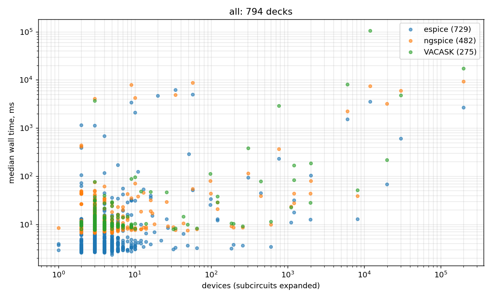

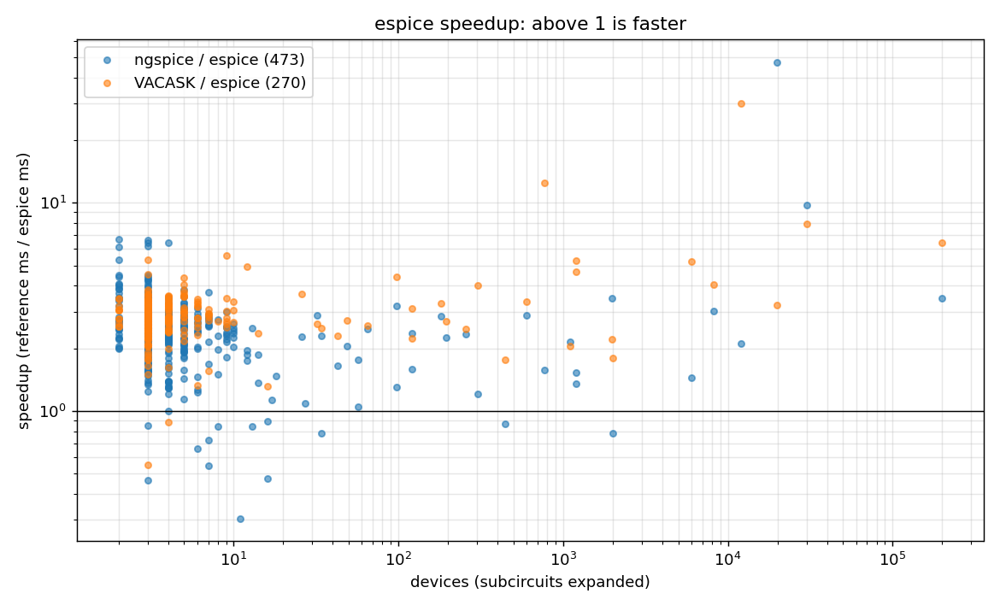

| Compared with | decks both ran | ESPice faster | median speedup |
|---|---:|---:|---:|
| ngspice 45 | 473 | 459 | 2.4x |
| VACASK 2026 | 270 | 268 | 2.8x |

Most decks finish in under 30 ms, so at the small end the speedup is mostly
process startup (the fastest deck takes 2.4 ms in ESPice, 6.6 in ngspice and
7.6 in VACASK). The large
circuits are where the comparison means something. Milliseconds:

| Deck | devices | ESPice | ngspice | VACASK |
|---|---:|---:|---:|---:|
| `resistor_grid_100x100` | 20k | 68 | 3,223 | 219 |
| `sweep_opamp_wl_5000` | 30k | 607 | 5,937 | 4,802 |
| `rc_ladder_100k` | 200k | 2,678 | 9,333 | 17,269 |
| `inverter_chain_4k` | 12k | 3,551 | 7,455 | 106,265 |
| `parallel_inverters_2000` | 6k | 1,536 | 2,216 | 8,032 |
| `vacask_graetz` | 9 | 3,434 | 7,904 | n/a |
| `vacask_rc` | 3 | 1,139 | 4,093 | 3,682 |
| `bench_ngspice_mosamp` | 34 | 6,242 | 4,882 | n/a |

`bench_ngspice_mosamp` is one of the 14 decks where ngspice is faster. ESPice
and ngspice agree on all of these except where the VACASK column differs from
both (`rc_ladder_100k`, `inverter_chain_4k`, `parallel_inverters_2000`).

### Per analysis

One chart per analysis type, same axes:

| | | |
|---|---|---|
| 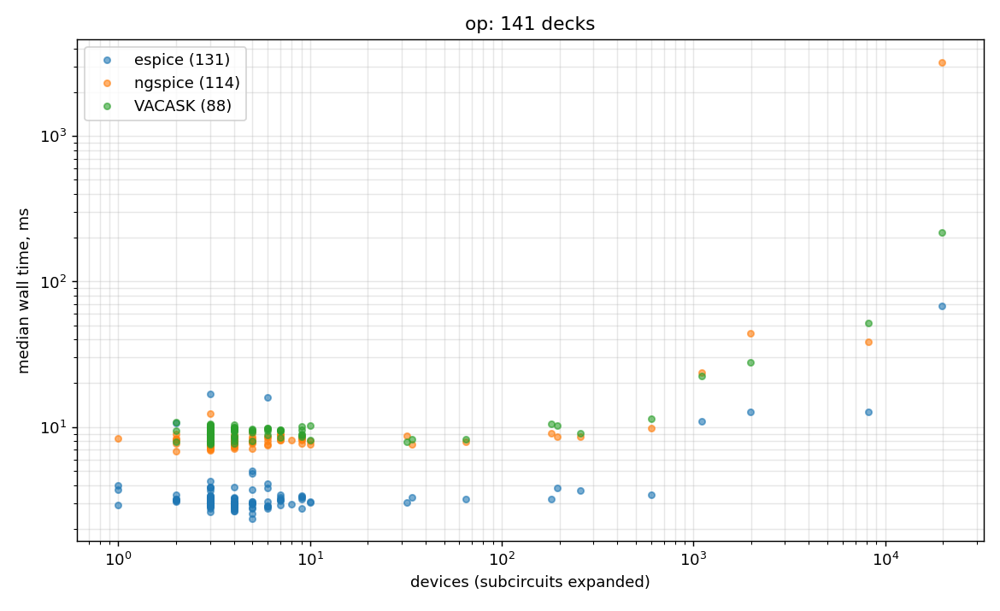 | 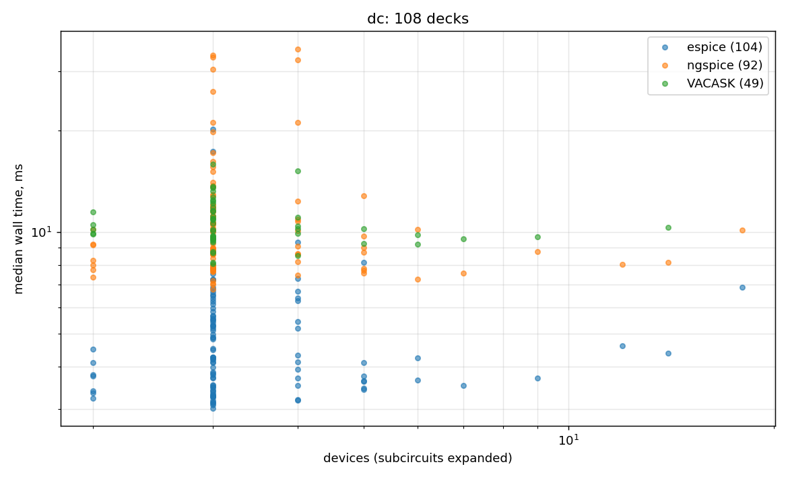 | 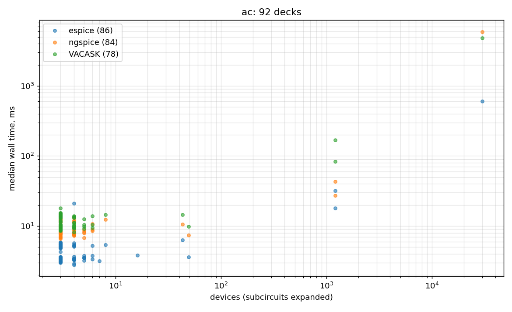 |
| 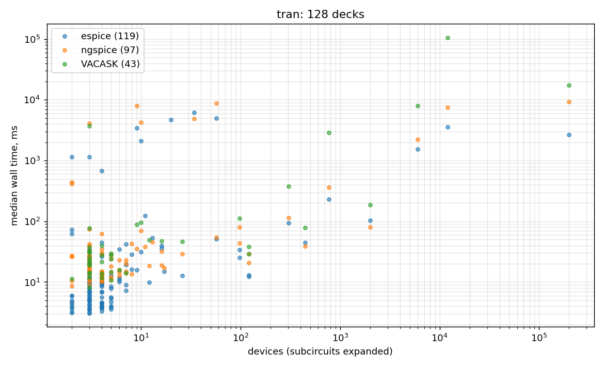 | 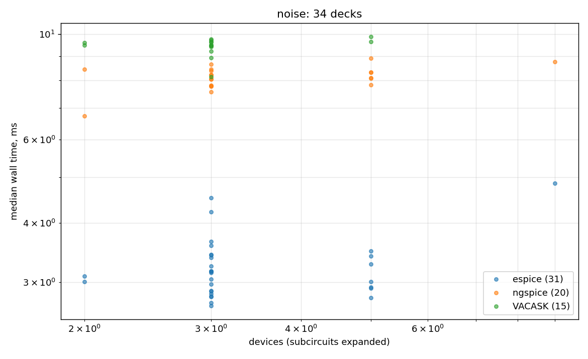 | 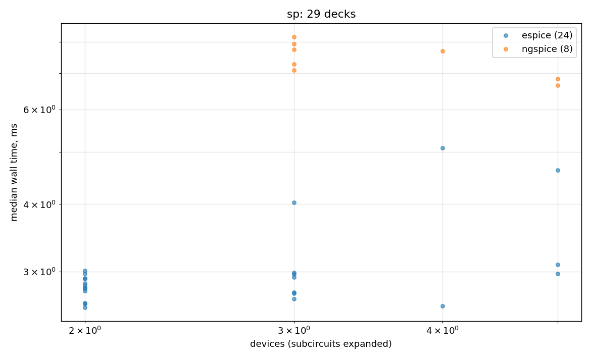 |
| 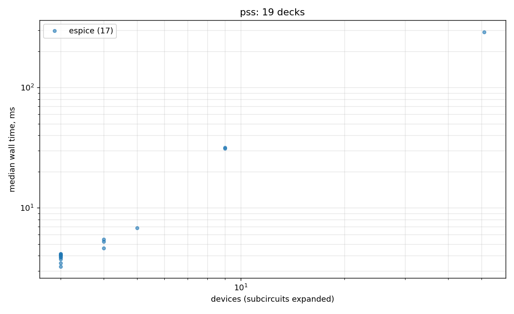 | 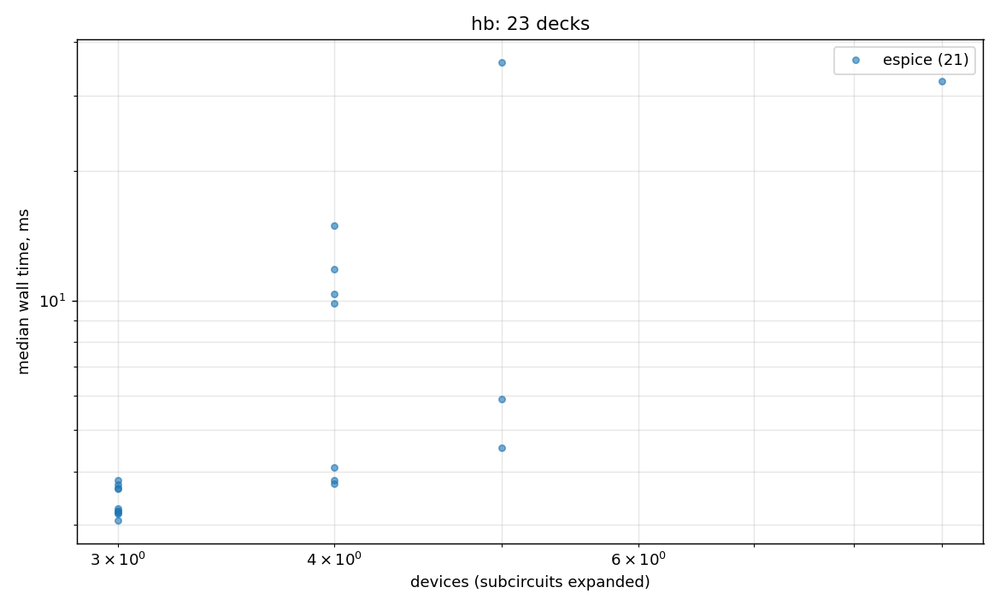 | 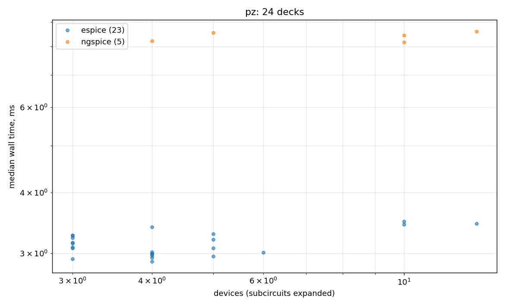 |

The other 35, mixed-analysis decks included, are in
[docs/bench/corpus/](docs/bench/corpus/). The periodic analyses (pss, pac,
pnoise, hb, qpss) ran in neither ngspice nor VACASK here, so those charts show
ESPice alone.

### Post-layout circuits

`zig build bench-postlayout` generates synthetic extracted netlists: standard
cells as subcircuits, RC-segmented signal nets, coupling caps and a meshed
power grid. There are four families (inverter chains, ring oscillators, random
logic, a 6T SRAM array), each with BSIM4 and PSP103 transistors, from 1k to
100k cells. ngspice 45 has no PSP103, so it runs only the BSIM4 decks. Each run
has a 300 s limit; a missing bar means the simulator timed out or could not run
the deck.

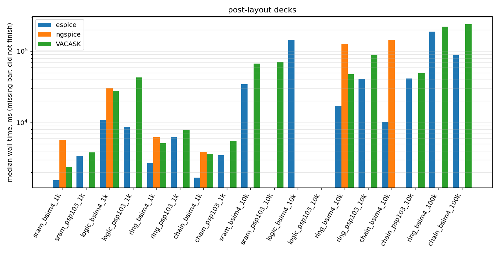

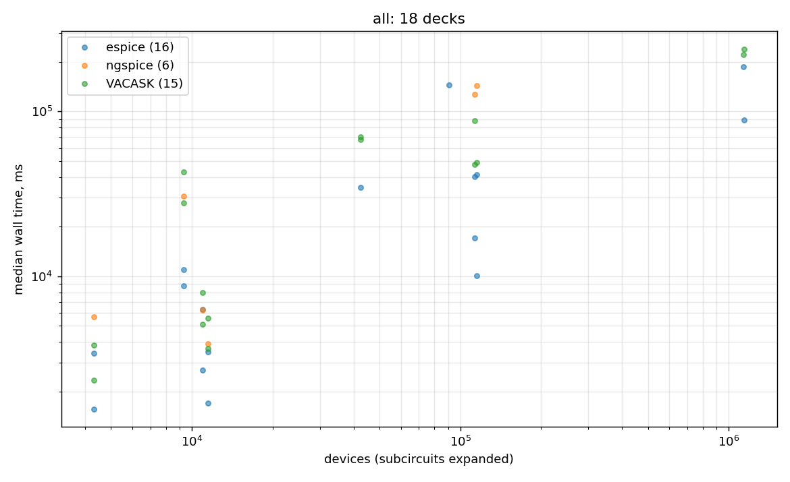

| Compared with | decks both ran | ESPice faster | median speedup | agree / differ |
|---|---:|---:|---:|---:|
| ngspice 45 (BSIM4 only) | 6 | 6 | 3.2x | 6 / 0 |
| VACASK 2026 | 14 | 14 | 1.9x | 6 / 8 |

The 8 differences against VACASK are every PSP103 deck where both finished, and
`chain_bsim4_100k`. They are open: for PSP103 there is no third simulator here
to say which side is right. ESPice timed out on `logic_psp103_10k` and
`sram_psp103_10k`; `logic_bsim4_10k` finished only in ESPice.

### What is not claimed

The bench is a differential comparison against two simulators, and it covers
only decks all three can express. "Could not run it" is mostly decks the other
simulator has no counterpart for: `.ic`, `.trannoise`, `u`/`o`/`t`/`z` device
cards, HSPICE-only syntax, and PWL sources, which this VACASK build aborts on.
The bench runner also starts every deck in the ngspice dialect, so 14 HSPICE
decks that pass in `zig build test` (which passes `--tokenizer hspice`) show as
failures there. A model in the dispatch table does not establish full SPICE
conformance; `docs/` carries per-area status labels and the measured
before/after numbers for each optimization.

## Project structure

```
├── src/
│   ├── core/         # Shared data: ids, numerics, queries, deck, results
│   ├── solver/       # Linear and nonlinear solvers, private to analysis
│   ├── device/       # Device ABI, evaluator, HDL loading, frozen Circuit
│   ├── frontend/     # Netlist parsing and circuit construction
│   ├── analysis/     # The analysis drivers
│   ├── output/       # Result encoders
│   ├── espice.zig    # The owning API
│   ├── c_api.zig     # The C ABI behind include/espice.h
│   └── main.zig      # CLI
├── models/           # Verilog-A device sources, compiled at build time
├── tests/            # 794 fixture decks, pending decks, the correctness harness, the bench runner
├── docs/             # Design notes and measured evidence
└── ref/              # SIMD strategy reference
```

`frontend` and `analysis` are siblings; neither imports the other. `espice`
composes both plus `output`, and `main` sees only `espice`.

To co-develop VerA or Gompute, point its entry in `build.zig.zon` back at a
local `.path` and restore the pin before pushing; a pinned build resolves to
the package cache and will not see your sibling checkout.

## Tests

`zig build test` runs every unit suite and then the numeric fixture corpus
(`tests/test_correctness.zig`, which runs `zig-out/bin/espice` on each deck
and scores it against its `.expected.json`). The step exits nonzero while any
deck fails; `issues.md` indexes the failing decks and their causes, and a
deck whose feature is missing says so in a `* KNOWN GAP:` comment.

Per-area steps, each part of `zig build test`:

| Step | Covers |
|---|---|
| `test-core` | shared data and numerics |
| `test-solver` | sparse, dense and frequency-lane LU, ordering, Newton/JFNK |
| `test-device` | device catalog, evaluator, ABI and cross-object error codes |
| `test-frontend` | netlist parsing, builder, prepared circuits |
| `test-analysis` | every analysis driver |
| `test-output` | waveform writers |
| `test-espice` | the Problem facade, the analysis contract and the C ABI (`test-c-api` alone) |

Outside `zig build test`: `zig build test-benchmark` tests the reference
adapters, `zig build bench-frontend` times netlist parsing, and
`zig build vera -- FILE.va` runs the bundled VerA compiler. Decks that are
written but not yet in the corpus wait in `tests/pending/`.

## Why the name

The pyramids were built long ago from scratch, were ahead of their time, and
were built to last. This simulator is not ahead of its time, but it is built to
last.
